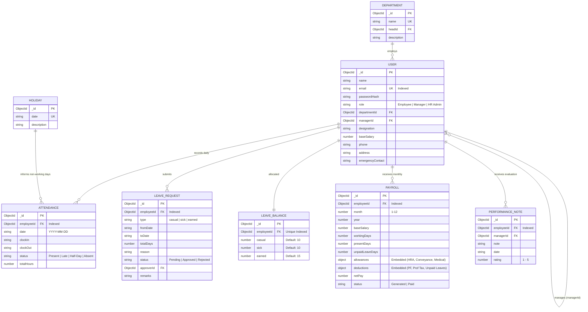

# Corporate HR & Payroll Management System (P04)

> **5th Semester • Christ University • CIA-3 Project Development**  
> **Domain:** Human Resources & Enterprise Systems  
> **Evaluation Reference:** L&T EduTech CIA-3 Specification (Pages 30–36)

---

## 👥 Project Team & Sprint Ownership

| Team Member | Branch Name | Assigned Role & Modules |
| :--- | :--- | :--- |
| **Christa Fijo** | `christa-sprint1-foundation` | **Sprint 1 (Foundation):** Employee Onboarding & Authentication, Department & Designation Management, Daily Attendance Tracking, Leave Request & Approval Workflow. |
| **Deepika Grace** | `deepika-sprint2-payroll-leaves` | **Sprint 2 (Core Workflow):** Leave Balance Management, Payroll Computation Engine, Payslip Generation Records, Employee Self-Service Profile. |
| **Eliza** | `eliza-sprint3-dashboard-analytics` | **Sprint 3 (Reporting & Polish):** Manager Team Dashboard, Holiday Calendar Management, Performance Note Logging, HR Reports & Analytics, Role-Based Access Control (RBAC). |
| **Cyrus David** | `cyrus-sprint4-schemas-postman-frontend` | **Sprint 4 (Integration & QA):** MongoDB Schema Design & Indexing, Seed Data Generator, Comprehensive Postman Test Collection, Angular Frontend Integration, Architecture Docs. |

---

## 🏗️ System Architecture & Data Relationships

### Entity-Relationship Diagram (Mermaid)



### Architectural Reasoning: Referencing vs. Embedding
- **Referencing (`ObjectId` references):**
  - `users`, `departments`, `attendance`, `leaveRequests`, and `payroll` are distinct business resources with high write frequency, independent lifecycles, and relational constraints. Referencing prevents document bloat and allows flexible querying without data duplication.
- **Embedding (Subdocuments):**
  - Allowances (`hra`, `conveyance`, `medical`) and Deductions (`pf`, `professionalTax`, `unpaidLeaveDeductions`) are directly embedded within `payroll`. Because a payslip is an immutable snapshot at computation time, embedding preserves financial audit trails regardless of future company-wide rate adjustments.

---

## 🚀 All 13 Functional Modules

1. **Employee Onboarding & Authentication:** Secure JWT-based registration (HR Admin restricted) and login with bcrypt hashing.
2. **Department & Designation Management:** Full CRUD operations for company hierarchy with head of department references.
3. **Daily Attendance Tracking:** Employee clock-in/out endpoints with timestamp computation, business rules preventing duplicate clock-ins, and late-mark logic.
4. **Leave Request & Approval Workflow:** Date range validations (`fromDate <= toDate`), overlapping leave detection, and manager approve/reject decisions.
5. **Leave Balance Management:** Automated tracking of casual, sick, and earned quotas; balance auto-deducts upon approval.
6. **Payroll Computation Engine:** Automated statutory salary engine computing Base Pay, 20% HRA, Conveyance, 12% PF, Professional Tax, and unpaid leave deductions.
7. **Payslip Generation Records:** Immutable monthly payroll records queryable by employee, with printable salary slip view.
8. **Employee Self-Service Profile:** Allows employees to update phone, address, emergency contact, and securely change their account password.
9. **Manager Team Dashboard:** Managers view real-time team attendance, pending team leaves, and team member summaries.
10. **Holiday Calendar Management:** HR defines company non-working days affecting attendance calculations.
11. **Performance Note Logging:** Managers log periodic performance notes and 1–5 star ratings for direct reports.
12. **HR Reports & Analytics:** Department-wise attendance percentage, salary expenditure reports, and executive summaries.
13. **Role-Based Access Control (RBAC):** Express authorization middleware enforcing permission sets across Employee, Manager, and HR Admin roles.

---

## 💻 Tech Stack

- **Backend:** Node.js, Express.js (MVC Folder Structure)
- **Database:** MongoDB with Mongoose ODM (Indexes, Constraints, References)
- **Authentication & Security:** JWT (JSON Web Tokens), `bcryptjs` password hashing
- **Frontend:** Angular Standalone SPA Architecture (`frontend/`) and Single-Page Browser Client (`public/`)
- **API Testing:** Postman Collection (`postman/corporate_hr_payroll.postman_collection.json`)

---

## ⚡ Quick Start & Setup Instructions

### 1. Prerequisites
- **Node.js:** v18+ (tested on Node v24)
- **MongoDB:** Local MongoDB instance running on `mongodb://127.0.0.1:27017` OR MongoDB Atlas URI in `.env`.

### 2. Installation
Clone the repository and install dependencies:
```bash
git clone <repository-url>
cd corporate-hr-payroll-system
npm install
```

### 3. Seed Database
Populate realistic seed data (departments, employees, managers, attendance history, leave balances, holidays, and past payroll):
```bash
npm run seed
```

### 4. Start the Application
```bash
npm start
```
- **Web UI:** [http://localhost:5000](http://localhost:5000)
- **API Health:** [http://localhost:5000/api/health](http://localhost:5000/api/health)

---

## 🔑 Pre-Seeded Demo Accounts

| Role | Name | Email | Password |
| :--- | :--- | :--- | :--- |
| **HR Admin** | Christa Fijo | `admin@company.com` | `Admin@123` |
| **Manager** | Deepika Grace | `manager@company.com` | `Manager@123` |
| **Employee 1** | Cyrus David | `employee@company.com` | `Employee@123` |
| **Employee 2** | Eliza | `eliza@company.com` | `Eliza@123` |

*(Note: The Web UI includes a 1-click Demo Role Switcher in the top bar to immediately switch between accounts without manual typing).*

---

## 📮 Postman Collection & Checklist

The official Postman Collection is located at:
`postman/corporate_hr_payroll.postman_collection.json`

### Import Instructions:
1. Open Postman.
2. Click **Import** > Select `corporate_hr_payroll.postman_collection.json`.
3. The collection is pre-configured with collection variables and automated tests for:
   - **Happy Path:** Register, Login, Clock-in, Leave Apply, Payroll Run.
   - **Validation Failure (400):** Missing mandatory fields.
   - **Business-Rule Conflict (400):** Duplicate clock-in on same day; overlapping leave dates.
   - **Authentication Failure (401):** Requesting protected route without JWT token.
   - **Authorization Failure (403):** Employee accessing HR-restricted endpoints.
   - **Not Found (404):** Accessing non-existent entity IDs.

---

## 🌿 4 Git Branches for GitHub Transfer

To push all 4 team members' work to GitHub:
```bash
git push --all origin
```

Branches available:
- `main` (Merged production-ready code)
- `christa-sprint1-foundation` (Auth, Onboarding, Departments, Attendance, Leaves)
- `deepika-sprint2-payroll-leaves` (Leave Balances, Payroll Engine, Payslips, Self-Service)
- `eliza-sprint3-dashboard-analytics` (Manager Dashboard, Holidays, Performance, Analytics, RBAC)
- `cyrus-sprint4-schemas-postman-frontend` (Mongoose Schemas, Postman Collection, Frontend, Docs)
